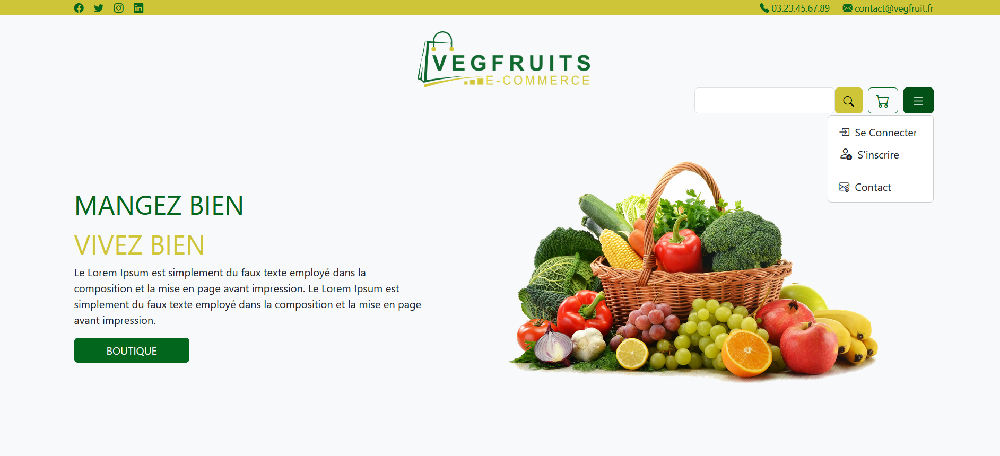

# Projet: E-Commerce Responsive
Il s’agit de créer une application classique type E-Commerce, avec des listes de
produits, détails produit, gestion de panier et validation de celui-ci. Avec
également une gestion simple du compte utilisateur.
Outils utilisée: Symfony 5,4, composer, data-fixtures,Easyadmin,  php-faker, bootstrap, web-pack, yarn

# Besoin :
• Page d’accueil avec la Liste produits.
• Page Détails d’un produit :
 - Ajouter le produit dans le panier (avec choix de quantité)
• Page Panier :
  - Modifier panier
  - Modification quantité
  - Suppression produit
  - Valider panier
  - Optionnel : simuler un paiement bancaire

• Gestion de Compte :
• Connexion
• Optionnel : Création de compte

## Screenshots

